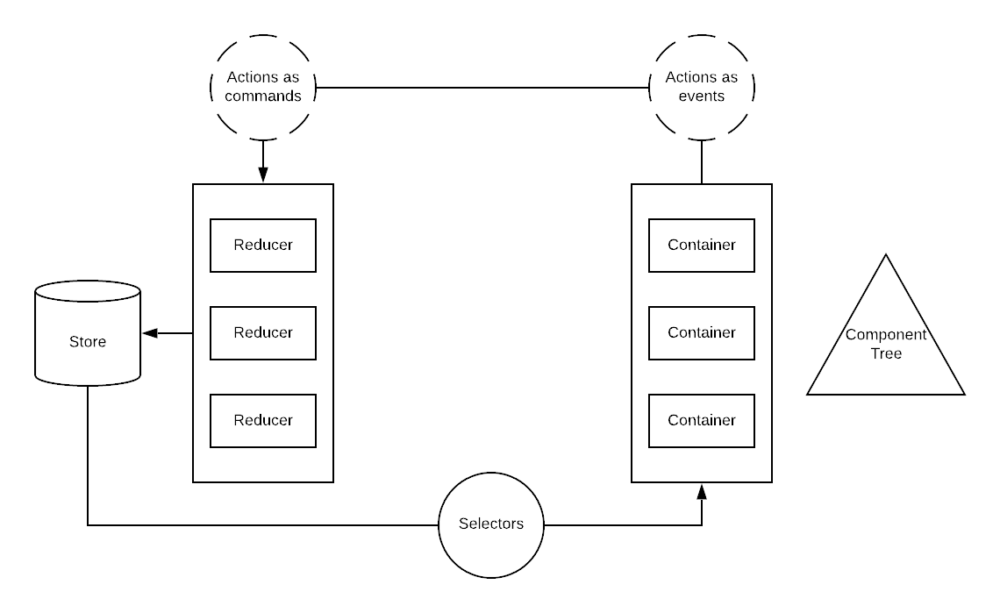

# Redux Patterns

## Table of Contents
- [Visualizing Redux](#visualizing-redux)
- [Reducers and State](#reducers-and-state)
- [Selectors](#selectors)
- [Containers and Components](#containers-and-components)
- [Actions](#actions)

## Visualizing Redux


_**Note:** Actions can take one of the two roles in this diagram, not both._

## Reducers and State

### Reducer Types

It is recommended to categorize your reducers into two types: entity reducers and domain-specific
reducers.

#### Entity Reducers

Entity reducers are reducers that deal with data entities, typically retrieved from an API
endpoint. There are many ways to construct the state tree to house these entities, but typically,
you will want some kind of key-value dictionary with ids pointing to objects. A very simple example
of an entity slice of state might look something like the following:

```javascript
{
  19367: { sku: 19367, name: 'Jeans', ... },
  49373: { sku: 49373, name: 'T-Shirt', ... },
  30958: { sku: 30958, name: 'Dress', ... },
  ...
}
```

In this example, we have a slice of state that stores products. The product's `sku` is known to be
a unique identifier so it is used as the key. You will likely need to transform the data from the
API into this format. This work can be done in the reducer when it receives the payload from the
server.

A key-value dictionary allows for instant lookup and should be used by other parts of your app to
retrieve the data it needs. If another reducer needs to store a reference to an entity or a list of
entities, store the ids in the reducer and use selectors to retrieve the actual data.

These reducers should only append, remove, or edit the entities.

#### Domain-Specific Reducers

These reducers are like your typical redux reducers. These should be grouped in a way that makes
sense for your app. For instance, they can be grouped by page, view, feature, etc. As mentioned
previously, if one of these reducers needs to store a reference to an entity, store the entity's id
to prevent data duplication. Preventing data duplication will save memory and prevent bugs that
result from inconsistent data entries.

## Selectors

Selectors act as the layer between the redux store and the containers. Selectors need to know how
the state tree is shaped as well as how the containers expect to receive data. In general, you will
probably want two types of selectors: general access selectors and container-specific selectors.

General access selectors are more basic and help you access particular parts of the state tree.
These selectors are meant to be shared and are the building blocks used to compose more complex
selectors.

Container-specific selectors are composed of general access selectors and custom logic to transform
the data into the correct format for the container consuming it. Use reselect for a performance
boost when writing selectors that require an operation greater than `O(1)`.

Suppose you are tasked with displaying the cart page for a user in an ecommerce app. You have one
entity reducers for all of the products that have been fetched in the app so far. You also have a
domain specific cart view reducer. In the following code sample, we have general access selectors
for the product entities and the products in cart as well as a container-specific selector for
transforming our product data so that it is suitable for the product list component within the cart
view.

```javascript
// selectors/entities/products.js

const selectProducts = state => state.entities.products;

// selectors/views/cart.js

import { createSelector } from 'reselect';

const selectProductIdsInCart = state => state.cart.productIdsInCart;

const selectProductsForCart = createSelector(
  selectProducts,
  selectProductIdsInCart,
  (products, productIdsInCart) => productIdsInCart.map(productId => {
    const product = products[productId]

    return {
      imageSrc: product.imageUrl,
      productName: `${product.color} ${product.name}`,
      productDescription: product.description
    };
  })
);

```

Notice that the names of the fields being passed to the container are different from the names of
the product entities' fields. Furthermore, there is one field that is composed of multiple pieces of
data. This will be the case if the underlying react components are built independent of redux, as
react component props should be named in a way that makes sense for the component. Doing so makes
the component more easily understandable to other developers and increases its reuse value. This
will be discussed in more detail in the containers and components section.

Additionally, the product entity likely has many more fields than four but in this particular case,
the underlying react component only needs three fields. Blindly passing data from the store to
components will undoubtedly lead to spaghetti code and data duplication down the line. It is
recommended to format the data before it is passed into the react layer of the app and to only pass
the data that is required in the component. By using selectors as a translation layer in the data
flow, you will be able to maintain the integrity of the underlying data while also maintaining the
modularity of the presentational react layer of the app. In other words, this promotes separation of
concerns.

## Containers and Components

_Forthcoming_

## Actions

You can conceptualize actions in one of two ways: actions as commands and actions as events. You
will need to agree to a paradigm that makes sense for your team and try to stick with it.

### Actions as Commands

This is, by and far, the most common way people think of actions. In this paradigm, actions are
typically coupled to reducers. Reducers essentially provide actions as an API to interact with the
state that a particular reducer governs. Thus, actions serve as _commands that are issued_ which are
then fulfilled by the reducers. Action types should be named `${VERB}_${NOUN}`.

Consider the following example. Your app needs to display modals at a global level and will only
display one modal at a time. You are tasked with showing a confirmation modal when the user clicks
the add to cart button on a product. You also need to add the item to the user's cart.

You've decided to have a modal reducer and a cart reducer. The modal reducer will accept two action
types: `OPEN_MODAL` and `CLOSE_MODAL`. `OPEN_MODAL` comes with a `payload`, which contains a string
that represents the modal that needs to be displayed. In one of your top-level components, you will
use the string to access a modal from a dictionary of possible modals to display.

Below is sample code of how this could be accomplished using actions as commands. Note that in a
real app, you'd likely split the code into domain-specific modules. For simplicity, the sample code
puts everything into one place.

To illustrate the modal mechanism, additional modals will also be shown in the sample code.

```javascript
// actions.js

const addProductToCart = productId => ({ type: ADD_PRODUCT_TO_CART, payload: productId });
const openModal = modalName => ({ type: OPEN_MODAL, payload: modalName });
const closeModal = () => ({ type: CLOSE_MODAL });

// reducers.js

const cartInitialState = { productIds: [] };
const cartReducer = (state = cartInitialState, { type, payload }) => {
  switch (type) {
    case ADD_PRODUCT_TO_CART:
      return { ...state, productIds: [...state.productsIds, payload ] };
    default:
      return state;
  }
};

const modalInitialState = { currentModal: null };
const modalReducer = (state = modalInitialState, { type, payload }) => {
  switch (type) {
    case OPEN_MODAL:
      return { ...state, currentModal: payload };
    case CLOSE_MODAL:
      return { ...state, currentModal: null };
    default:
      return state;
  }
};

// product/container.js

const mapDispatchToProps = dispatch => ({
  onAddToCartClick: productId => {
    dispatch(addProductToCart(productId));
    dispatch(openModal(ADD_TO_CART_CONFIRMATION_MODAL));
  }
});

// sign-up/container.js

const mapDispatchToProps = dispatch => ({
  onTermsAndConditionsClick: () => dispatch(openModal(TERMS_AND_CONDITIONS_MODAL))
});

// home/container.js

const mapDispatchToProps = dispatch => ({
  onSignInClick: () => dispatch(openModal(SIGN_IN_MODAL))
});
```

Other containers that need to launch a modal would also `dispatch` the `openModal` action and pass
a modal string. In this scenario, each container needs to know what modal it's supposed to launch.

### Actions as Events

In this paradigm, actions represent events that occured outside of the store. This includes user
interaction, server responses, etc. As a result, actions are coupled more to the containers and
underlying component tree and represent _what happened in the past_. Containers will fire off these
actions simply to inform your app that something happened. After that, it's up to the consumers of
these action events to decide how to react. Reducers, in this case, act as _reactive watchers_.
Actions should be labeled in the **past tense**.

We will use the same example from above to illustrate what this might look like in code. Instead
of three specific command actions, we will only need one action, `ADD_TO_CART_CLICKED`, to signify
the fact that the add to cart button was clicked. The logic for this same feature thus lives within
the reducers rather than spread across several disparate actions.

Again, additional modals are shown in the sample code and in a real app, this code would be split
into modules. The following replicates the functionality of the above example within the
actions-as-events paradigm.

```javascript
// actions.js

const addToCartClicked = productId => ({ type: ADD_TO_CART_CLICKED, payload: productId });
const termsAndConditionsClicked = () => ({ type: TERMS_AND_CONDITIONS_CLICKED });
const signInClicked = () => ({ type: SIGN_IN_CLICKED });

// product/container.js

const mapDispatchToProps = dispatch => ({
  onAddToCartClick: productId => dispatch(addToCartClicked(productId))
});

// sign-up/container.js

const mapDispatchToProps = dispatch => ({
  onTermsAndConditionsClicked: productId => dispatch(termsAndConditionsClicked())
});

// home/container.js

const mapDispatchToProps = dispatch ({
  onSignInClicked: () => dispatch(signInClicked())
});

// reducers.js

const cartInitialState = { productIds: [] };
const cartReducer = (state = cartInitialState, { type, payload }) => {
  switch (type) {
    case ADD_TO_CART_CLICKED:
      return { ...state, productsInCart: [...state.productsInCart, payload] };
    default:
      return state;
  }
};

const modalInitialState = { currentModal: null };
const modalReducer = (state = modalInitialState, { type, payload }) => {
  switch (type) {
    case ADD_TO_CART_CLICKED:
      return { ...state, currentModal: ADD_TO_CART_CONFIRMATION_MODAL };
    case TERMS_AND_CONDITIONS_CLICKED:
      return { ...state, currentModal: TERMS_AND_CONDITIONS_MODAL };
    case SIGN_IN_CLICKED:
        return { ...state, currentModal: SIGN_IN_MODAL };
    default:
      return state;
  }
};
```

### Pros and Cons

_Forthcoming_
